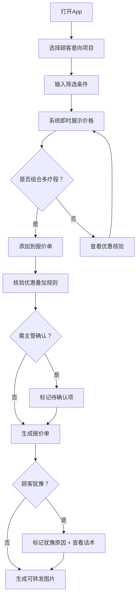

## 1. 产品概述

医美咨询师移动端价格查询与报价助手，专为前台咨询师在面诊沟通场景下快速查询项目价格、组合报价、核验优惠而设计。解决咨询现场频繁翻群消息、口头确认价格、优惠规则不清等痛点，提升咨询师专业度与成交效率。

- 目标用户：医美机构前台咨询师、面诊顾问
- 核心价值：即时价格查询 → 一键组合报价 → 优惠自动核验 → 可转发报价图片

## 2. 核心功能

### 2.1 用户角色

| 角色 | 注册方式 | 核心权限 |
|------|----------|----------|
| 咨询师 | 机构账号分配 | 查询价格、创建报价单、核验优惠、收藏项目、查看话术 |
| 主管 | 机构账号分配 | 咨询师全部权限 + 优惠审批确认 |

### 2.2 功能模块

1. **今日价格**：按项目分类浏览实时价目表，支持搜索与筛选
2. **顾客报价单**：组合多个疗程形成报价单，支持价格拆分与图片生成
3. **套餐组合**：浏览预设套餐与自定义组合，查看组合优惠
4. **优惠核验**：核验可用优惠、叠加规则、需主管确认项
5. **收藏常用**：收藏常用项目与套餐，快速访问
6. **话术提示**：按场景推荐销售话术，辅助沟通

### 2.3 页面详情

| 页面名称 | 模块名称 | 功能描述 |
|----------|----------|----------|
| 今日价格 | 项目分类导航 | 按水光/光电/注射/手术/修复等分类展示 |
| 今日价格 | 快速搜索栏 | 支持项目名、品牌、部位关键词搜索 |
| 今日价格 | 价格卡片 | 显示标准价、活动价、最低成交边界、不可叠加说明 |
| 今日价格 | 筛选面板 | 部位、次数、指定医生、是否老客筛选 |
| 今日价格 | 耗材信息 | 展示耗材品牌与规格 |
| 今日价格 | 扫码识别 | 扫码识别顾客会员等级，影响价格展示 |
| 顾客报价单 | 项目选择器 | 从价目表添加项目到报价单 |
| 顾客报价单 | 报价明细 | 显示各项目价格小计与总计 |
| 顾客报价单 | 价格拆分 | 单次价、疗程价、分期参考三档展示 |
| 顾客报价单 | 犹豫标记 | 标记顾客犹豫原因（价格/效果/恢复期/对比） |
| 顾客报价单 | 生成图片 | 生成可转发给顾客的简洁报价图片 |
| 顾客报价单 | 历史报价 | 保存并查看历史报价记录 |
| 套餐组合 | 预设套餐 | 展示机构预设优惠套餐 |
| 套餐组合 | 自定义组合 | 咨询师自由组合项目，系统计算组合价 |
| 套餐组合 | 组合对比 | 套餐价 vs 单买价对比展示 |
| 优惠核验 | 优惠列表 | 展示当前可用优惠活动 |
| 优惠核验 | 叠加规则 | 显示哪些优惠可叠加、哪些互斥 |
| 优惠核验 | 审批提示 | 标记需主管确认的优惠项 |
| 优惠核验 | 过期隐藏 | 自动隐藏已过期活动 |
| 收藏常用 | 收藏项目 | 收藏常用项目快速访问 |
| 收藏常用 | 收藏套餐 | 收藏常用套餐快速访问 |
| 收术提示 | 场景分类 | 按价格异议/效果疑虑/恢复期担忧等场景分类 |
| 话术提示 | 话术卡片 | 每条话术含开场白、核心论点、收尾引导 |
| 话术提示 | 收藏话术 | 收藏常用话术 |

## 3. 核心流程

**主流程**：咨询师打开App → 选择顾客意向项目 → 输入筛选条件（部位/次数/医生/老客）→ 系统即时展示价格（标准价/活动价/最低成交边界）→ 组合多个疗程 → 核验优惠叠加 → 生成报价单 → 标记犹豫原因 → 生成可转发图片

**离线流程**：无网络时自动切换到本地缓存价目表，标识"离线数据"提示，核心查询功能不受影响。

## 4. 用户界面设计

### 4.1 设计风格

- **主色调**：玫瑰金（#B76E79）+ 暖白（#FFF8F6），传递医美行业的精致与温暖
- **辅助色**：深灰（#2D2D2D）用于正文，浅灰（#F5F0EE）用于背景分区
- **按钮风格**：圆角（12px），主按钮玫瑰金填充，次按钮描边
- **字体**：标题使用 Noto Serif SC 衬线体，正文使用 Noto Sans SC
- **布局风格**：移动端底部Tab导航，卡片式布局，圆角阴影
- **图标风格**：线性图标（Lucide），1.5px描边，玫瑰金着色

### 4.2 页面设计概览

| 页面名称 | 模块名称 | UI要素 |
|----------|----------|--------|
| 今日价格 | 搜索栏 | 固定顶部，圆角输入框，搜索图标 |
| 今日价格 | 分类标签 | 横向滚动胶囊标签，选中态玫瑰金填充 |
| 今日价格 | 价格卡片 | 白底圆角卡片，左侧项目名/品牌，右侧三档价格纵向排列 |
| 今日价格 | 筛选面板 | 底部抽屉弹出，多选标签组 |
| 今日价格 | 扫码入口 | 右下角悬浮按钮，扫码图标 |
| 顾客报价单 | 项目列表 | 可滑动删除，展开显示价格拆分 |
| 顾客报价单 | 底部操作栏 | 固定底部，总价 + 生成图片按钮 |
| 顾客报价单 | 犹豫标记 | 底部弹出选择面板 |
| 顾客报价单 | 价格拆分 | 三列等宽展示：单次价/疗程价/分期参考 |
| 套餐组合 | 套餐卡片 | 大卡片，顶部套餐名，中部项目清单，底部对比价 |
| 套餐组合 | 自定义组合 | 浮动添加按钮，组合编辑页面 |
| 优惠核验 | 优惠卡片 | 左侧标签（可用/互斥/待确认），右侧优惠详情 |
| 优惠核验 | 叠加说明 | 展开式折叠面板，显示叠加规则 |
| 收藏常用 | 收藏列表 | 网格布局，2列，图标 + 项目名 |
| 话术提示 | 场景标签 | 横向滚动彩色标签 |
| 话术提示 | 话术卡片 | 左侧竖条色标，标题 + 内容预览 |

### 4.3 响应式设计

- **移动优先**：设计以375px宽度为基准，最大适配428px
- **底部导航**：6个Tab固定底部，图标 + 文字标签
- **触摸优化**：最小点击区域44px，卡片间距12px，滚动流畅
- **单手操作**：核心操作区域在屏幕下半部分

### 4.4 离线设计

- 离线时顶部显示金色提示条"当前为离线数据，价格可能有变动"
- 最近一次在线价目表自动缓存到 localStorage
- 仅查询和收藏功能可用，报价单图片生成需网络
