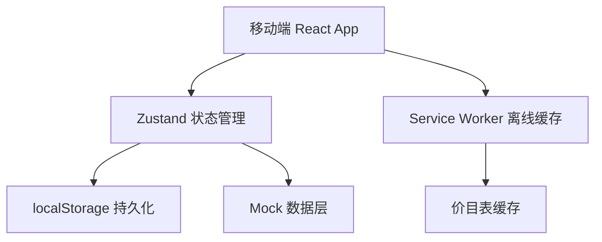
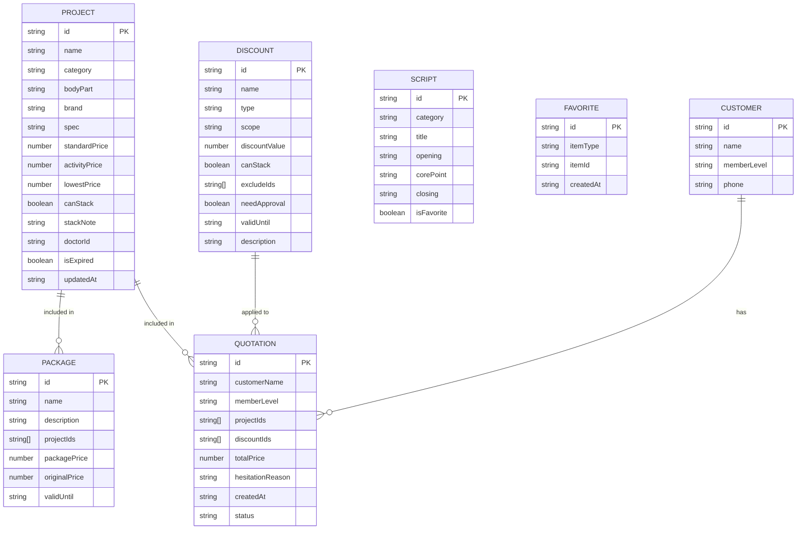

## 1. 架构设计

纯前端架构，无后端依赖。使用 Mock 数据模拟所有业务数据，localStorage 实现数据持久化与离线访问，Service Worker 缓存静态资源与价目表。

## 2. 技术说明

- **前端**：React@18 + TypeScript + Tailwind CSS@3 + Vite
- **初始化工具**：vite-init (react-ts 模板)
- **状态管理**：Zustand（含 persist 中间件）
- **路由**：react-router-dom@6
- **图标**：lucide-react
- **图片生成**：html2canvas
- **离线缓存**：localStorage + Service Worker
- **后端**：无（纯前端 Mock 数据）

## 3. 路由定义

| 路由 | 用途 |
|------|------|
| / | 今日价格页面，项目浏览与查询 |
| /quotation | 顾客报价单，组合报价与图片生成 |
| /packages | 套餐组合，预设与自定义套餐 |
| /discount | 优惠核验，优惠规则与叠加校验 |
| /favorites | 收藏常用，快速访问常用项目 |
| /scripts | 话术提示，场景化销售话术 |

底部 Tab 导航切换以上6个路由，URL 与 Tab 一一对应。

## 4. 数据模型

### 4.1 数据模型定义

### 4.2 数据定义

所有数据使用 TypeScript 类型定义，Mock 数据存储于 `src/data/` 目录。localStorage 缓存键：

- `price_cache`：价目表缓存（含时间戳）
- `quotations`：历史报价单
- `favorites`：收藏列表
- `offline_mode`：离线模式标识
